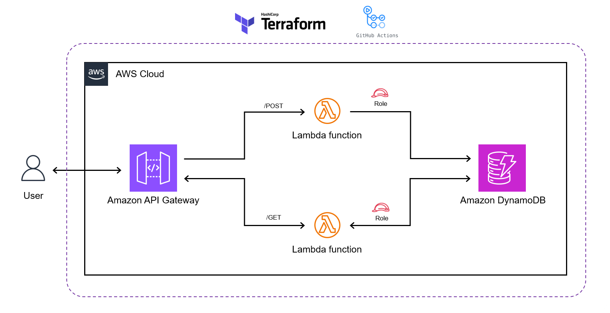

# Cloud Proyect 
## Proyect with Terraform-AWS-Github actions

## Resume
A fully serverless application deployed on AWS, using API Gateway, Lambda functions, and DynamoDB to handle GET and POST requests. The entire infrastructure is defined using Terraform and automatically deployed via GitHub Actions pipelines.

### Technologies Used

- AWS Lambda – Two functions for handling GET and POST operations.
- API Gateway – Exposes HTTP endpoints to trigger the Lambdas.
- DynamoDB – NoSQL database to persist and query data.
- Terraform – Infrastructure as Code (IaC) for provisioning all AWS resources.
- GitHub Actions – Automates deployment of both infrastructure and Lambda code.
- IAM Roles & Policies – Secure permission management using least privilege principles.